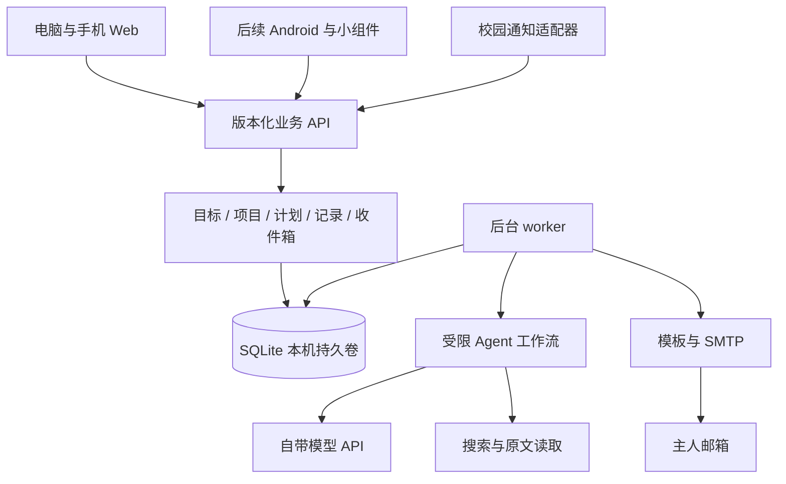

# 个人学习与职业探索 Agent 工作台

## 完整产品与开发计划 v1.2（A 方案定稿）

修订日期：2026-09-28。状态：计划书撰写完成；用户已选择 A 首页布局。沿用 v1.1 对抗审查后的业务契约，补齐 UI、交互、响应式、实施及验收规格。已有示例交互草图，正式应用尚未实现或部署。v1.1 保留为本次修订基线。

开发以 [CODING-AGENT-开发执行计划.md](./CODING-AGENT-开发执行计划.md) 的具体契约为准；本文件解释产品与架构。此前审查的原始意见见 [产品审查](./review-product.md)、[架构审查](./review-architecture.md)、[执行审查](./review-execution.md)；这些意见早于本版，裁决以当前两份正式计划为准。后文“可配置”在 V1 仅指执行文档明确列出的字段，不授权实现通用平台。

“已确认”指用户在本次讨论明确表达的要求。“建议默认”是本计划为使实施可执行而给出的选择，可继续调整。专业方向示例不是对用户能力的测评，也不是学校官方培养或推免要求。

## 1. 产品定义与已确认要求

**产品定义：学生独立部署、自用的学习与职业探索 Agent 工作台，通过目标、行动、成果和反馈，帮助自己安排学习、判断方向并选择值得投入的项目。**

每个实例只有一位主人，软件可分发给同学，各自部署、配置和使用。主人可以从电脑和手机访问同一实例。

| 已确认要求 | 对应设计 |
| --- | --- |
| 安排学习、看清专业方向、选择项目 | 学习计划与方向实践两条主线 |
| 个人倾向科研或保研 | 可选个人路线；科研探索和升学准备分别组织 |
| 统一待办与成长规划入口 | 一个工作台；原 Todo 数据可迁入 |
| 按身份筛掉不相关校园通知 | 身份规则、原文提取、待确认与可纠正筛选 |
| 接受每日简短记录 | 进展与卡点随任务记录，不强制长篇日记 |
| 希望适当增强主动能力 | 事件触发、定期探索、复盘建议、明确的自动行为范围 |
| 紧凑工作台、状态与行动并重，选择 A | 顶部状态带与下方任务／决策双栏，手机顺序重排 |
| 每人独立部署、自用，重视简洁与隐私 | 单用户实例，无租户、班级或组织管理 |
| 首版 Web，可部署到自己的 VPS | 响应式 Web 与可复现部署包 |
| 后续 Android，通知与小组件优先 | 版本化 API、今日摘要接口、设备授权扩展点 |
| 离线保守 | 首版新增记录草稿，在线修改正式计划 |
| 已有模型端点与调用 key | 可配置模型适配层，密钥仅在服务端使用 |
| 邮件提醒，自定格式 | SMTP 配置、HTML 与纯文本模板、持久化调度 |
| 同时支持按需搜索和定期探索 | 即时探索请求 + 按方向开启的探索订阅 |

目前已有 Todo 与校园通知插件的真实使用记录。截图显示校园事务、学习任务和生活事项混排。该截图能证明使用场景，不能证明任何具体通知是否适用于用户。

## 2. 为什么这是 Agent 应用

它具有目标上下文、持久记录、外部工具、主动触发和反馈循环：

1. 读取用户确认的身份、目标、现有安排与近期记录。
2. 理解一个明确的问题，例如“这个通知是否适用”或“本周卡点下一步怎么处理”。
3. 按权限调用搜索、读取资料、生成提案等工具。
4. 将结果变成可查看的候选方向、任务草案或调整建议。
5. 在授权范围内执行动作；重要计划变更由主人确认。
6. 结合后续成果与反馈，修正以后给出的建议。

这里的持续改进来自更新上下文、偏好和规则，不默认训练模型，也不承诺 AI 能准确预测职业适配度。

**建议架构是一个领域 Agent 配合若干固定工作流程。** 截止计算、任务状态、去重、邮件调度和数据库读写由程序负责；模型承担语义理解与建议生成。首版无需多 Agent 协作或长期无边界自主运行。

## 3. 核心价值与使用原则

每次打开工作台，尽量回答四个问题：现在的重点是什么、有什么实际进展、哪里需要调整、下一步做什么。

目标按三个尺度组织：

- 长期：方向、理由、候选路径与阶段里程碑，允许并列和变化。
- 学期：当前基础、实践与需要验证的问题。
- 近期：一至两周的具体行动，具备可检查的完成标准。

四年路线是可修订的概览，不预先排四年的每日任务。完成率只用于描述安排兑现情况，不换算为能力、科研潜力或保研概率。

建议将“是否与我有关”“是否必须处理”“是否值得投入”“是否适合现在开始”分别表达。必办事务可以与职业目标无关；自由探索也不需要强行关联职业价值。

## 4. 首版范围与后续扩展

首版 V1 包含下表核心项；阶段划分用于迭代交付，不意味着只交付一个待办壳。

| 模块 | V1 必须具备 | 后续扩展 |
| --- | --- | --- |
| 个人配置 | 单主人登录、身份、兴趣、时间约束、目标 | Android 设备配对 |
| 收件箱 | 手动输入、插件导入、条件提取、分流与纠正 | 更多校园信息来源 |
| 计划 | 手填每周可用窗口、固定活动、目标、任务、周视图及已知负担 | 自动排程、复杂日历与甘特图 |
| 方向探索 | 方向说明、候选实践、比较与选择 | 更丰富的专业模板 |
| 项目实践 | 阶段、任务、成果、卡点、结束复盘 | 分享经过筛选的项目模板 |
| AI 助手 | 当前项目或周范围内的提问、结构化建议、独立原子提案 | 无限历史会话与更多工具 |
| 外部探索 | 按需搜索、可开启的定期搜索、来源与去重 | 扩展搜索服务与专业订阅源 |
| 回顾 | 简短日志、周复盘草案、调整记录 | 跨学期回顾 |
| 通知 | 固定模板的栏目、顺序、摘要长度、主题色、隐私与时间设置 | 任意模板编辑、Android 通知与小组件 |
| 离线 | 日志草稿保存与幂等补交 | 少量只读缓存 |
| 自部署 | 容器配置、持久目录、备份恢复、导出 | 更多主机架构构建产物 |

V1 输入限粘贴文本、URL、手填结构化课程和时间；成果仅文本与链接。文件上传、OCR、PDF解析、自动学校课表、任意模板和甘特图均为后续范围，不能用“支持资料”隐含加入。日用切片与完整 Web V1 的结束条件见执行文档第 12 节。

## 5. UI 与交互实施规格：A 方案

### 5.1 设计决定与适用范围

用户已确认采用 A「顶部状态带＋下方双栏」，选择更紧凑的工作台，并要求首屏兼顾状态和行动。B 常驻状态侧栏作为历史比较稿保留，不实现为生产中的布局切换功能。

本节的路由、尺寸、颜色和数量上限是可直接实施的默认值；用户确认的是布局方向，不意味着逐一认可所有细节。实现者可以为实际内容与可访问性做小幅修正，并记录原因，不需要每一处重新询问。首版完成后再依据实际使用调整。

### 5.2 导航与路由

| 入口 | 路由 | 页面职责与主要动作 |
| --- | --- | --- |
| 今天 | `/today`；登录后 `/` 跳转此页 | 状态摘要、近期行动、待决定事项、快速记录 |
| 计划 | `/plan` | 默认本周，内部切换目标、周安排、项目；维护时间窗口与固定活动 |
| 探索 | `/explore` | 发起问题、管理关注方向、查看执行状态、比较候选实践 |
| 收件箱 | `/inbox`；详情 `/inbox/[id]` | 需行动、资讯、机会、待确认、已折叠；查看原文及纠正 |
| 回顾 | `/reviews`；详情 `/reviews/[id]` | 日常记录、周回顾、成果、独立建议及本人修订 |
| 项目详情 | `/projects/[id]` | 归属计划；目的、前置条件、任务、成果、卡点、结束判断 |
| 设置 | `/settings` | 侧栏底部次级入口；身份、来源规则、集成状态、邮件、会话与数据导出 |
| 提醒记录 | `/notifications` | 由今天页次级入口进入；站内事件与邮件尝试状态 |
| 初始化／登录 | `/setup`、`/login` | 建立唯一主人、登录与恢复访问；私有页面保留登录后的返回地址 |

桌面固定使用五项主导航；近期项目最多显示三个快捷入口，更多项目进入计划页查看。项目不是第六项并列主导航。设置不放到首页主要操作区。设置中的备份说明只链接操作手册，首版不增加 Web 备份或恢复按钮。

页头显示当前位置、页面标题与一个主要动作。全局快速记录入口固定可找；不增加没有真实用途的搜索框、全局大聊天框、积分总览或消息装饰。

### 5.3 桌面首页结构

```text
主导航  │ 今天                                      写记录
        │ 本周重点        剩余任务·已知估时       未来可安排时间
        │─────────────────────────────────────────────────
        │ 近期行动（约 2/3）        │ 需要你决定（约 1/3）
        │ 今天／逾期／近期          │ 条件待确认、计划调整
        │ 完成、记录、项目与来源    │ 依据、差异、处理入口
        │──────────────────────────│
        │ 最近记录                  │
```

状态带与首组行动应在常用桌面首屏中出现；内容超出时正常滚动，不固定整页高度、不为塞进一屏缩小文字。双栏只用于足够宽的内容区，必要时改为单栏。

| 区域 | 数据与默认展示规则 | 空缺或异常时 |
| --- | --- | --- |
| 本周重点 | 主人选定的一项重点，可关联 goal/project，也可自由填写；附最近确认时间和详情入口 | 显示“尚未设置本周重点”，提供设置入口，不由 AI 自动指定 |
| 剩余任务 | 本周 todo/doing/blocked 的已知估时；doing 仍按全额估计；未知数量另列 | 无任务显示“本周暂无已安排任务”；无估时显示未知，不显示零负担 |
| 未来容量 | 当前时刻到周末，可用窗口并集扣固定事件再预留缓冲；展示计算依据与更新时间 | 未设置时间时显示“尚未设置可用时间”，不画比例或下合理性结论 |
| 近期行动 | 首页最多六项未完成任务；逾期、今天计划、今天截止、未来七天已安排或临近截止、本周未定时依次呈现；组内先具体时间，再高优先级、创建顺序 | 逾期单独标识；未排时间不伪装成今天必须完成；更多进入计划页 |
| 需要你决定 | 最多三项，展示有真实证据截止的紧急事项，再条件待确认及有效提案；显示剩余数量 | 未知截止不造紧迫感；全部处理后显示简短空状态 |
| 最近记录 | 最近三条，显示日期、关联对象、进展摘要和卡点；展开看全文 | 未记录时提供“写一条”，不显示零成长或自动补总结 |

近期行动只覆盖上述范围；完整任务管理在计划页。排序不使用模型生成的综合价值分。条件待确认是收件箱待决事项，只有主人手动创建的确认任务才出现在任务列表，不能因通知缺信息就自动制造待办。

负担条仅在容量已知且大于零时显示；超过容量时数值明确显示“至少超出 X 分钟”，条形可达到满格并附超额文字。容量为零时不除以零。未知估时始终保留，不能因已知部分低于容量就宣称一定安排得下。整周承诺负担在计划页查看，避免与首页剩余负担混淆。

待决定数量仅统计当前可处理项；已应用、拒绝、过期、暂缓中的提案不混入。暂缓必须显示恢复日期，期满重新评估有效性；V1 默认暂缓到实例时区次日 09:00，用户可改。已应用反馈短暂呈现后移入活动记录，不长期占用待决定面板。

### 5.4 各页面的完整结构

**计划页。** 默认周列表，支持周切换；不要求首版实现拖拽日历。顶部展示整周承诺与未来剩余两个清楚区分的口径。按天列出任务、固定活动和冲突；未排具体时段的本周任务单列。任务编辑包括项目／目标、状态、优先级、估时、周归属、计划时段、截止精度、提醒规则。长期和学期目标用可修订的列表与里程碑呈现，避免提前展开四年每日任务。

**探索页。** 先填问题和可选目标／项目范围；区分按需搜索与关注方向。运行中显示实际阶段与取消入口，不显示虚构百分比。每次默认展示最多三个候选，比较问题、实际活动、前置条件、材料、投入范围、产出、第一步、来源与缺口。查看详情后可保存为想法，或编辑项目草案再开始；资源未知时显式确认带未知开始，不使用“最适合你”等无依据标签。

**项目页。** 头部显示待验证问题、状态和下一步；任务与记录为主区，前置条件及实践路径为辅助区。成果是可编辑文本或链接。结束项目时分别填写完成事实、实际体验、是否愿意继续及原因；允许“未定”，不把任务完成等同于方向适配。暂停与归档有不同说明。

**收件箱。** 列表显示分区、标题、来源、截止精度和判定标签；详情显示原文版本、引用、逐项条件与处理历史。纠正默认仅本条，身份更正和未来规则单独操作。规则预览展示结构化条件与已知受影响数量；尚未计算时显示未知，不能预设数量。来源更新展示前后差异，主人确认后才更新正式任务。

**回顾页。** 周范围、事实记录、成果、主人判断与模型推测分开。建议逐份展示理由、证据、修改前后值及影响对象。每份提案只有整体接受／拒绝／暂缓，不提供内部任意操作半选。没有记录时说明依据不足，允许手写复盘。阶段报告先选择字段和记录，再预览 Markdown，最后导出。

**设置与提醒记录。** 设置提供个人事实编辑、可用时间入口、来源规则、集成是否配置、邮件模板和发送时间、预算、会话撤销、业务导出。密钥只提示如何在部署环境配置，不提供回显或输入表单。提醒记录展示 scheduled/queued/submitting/accepted/failed/unknown/cancelled 的业务含义，accepted 文案为“发送服务已接受”；unknown 为“结果未确定，可能已发送”，显式重发提示重复风险。

**页面内助手。** 以“分析这个卡点”“解释这份建议”等入口展开，默认范围显示当前项目或当前周，可查看实际引用。文本建议可编辑，涉及正式数据变更时必须转为结构化提案。移动端展开为完整页面或可关闭面板，不遮挡正文和提交反馈。

### 5.5 关键交互与状态

| 触发 | 界面行为 | 持久化与失败处理 |
| --- | --- | --- |
| 勾选完成 | 当前行显示提交中；成功后更新本页任务和负担 | 服务端成功后显示完成；失败保留原状态及重试入口，不误报已保存 |
| 写记录 | 顶部明确关联任务／项目或“日常记录”；进展和卡点至少一项非空 | 每条独立 ID；本机草稿、提交中、已保存、失败四态分清；不得共用一份全局记录变量 |
| 调整计划 | 展示当前与建议值、时区、来源和版本生成时间 | 应用中禁重复按钮；幂等由服务端保证；409 保留输入并展示最新内容 |
| 纠正通知 | 单条操作与身份／规则操作分开；可查看作用域 | 成功才更新分区；规则更改不能自动改写已确认任务 |
| 保存候选 | idea 与 active 分开；展示前置条件状态 | 不用现有项目页的标题替换来模拟新建，必须创建独立项目对象 |
| 请求 AI 或搜索 | 先展示已排队，再显示后台真实阶段与结果 | 202 不显示“生成完成”；失败保留问题、允许有界重试；停用订阅后不继续发布结果 |
| 页面或网络失败 | 错误在所属区域显示，已加载内容注明更新时间 | 不把旧数据变成零，不把网络失败当空列表，不阻断其他可用模块 |
| 草稿与登录过期 | 保留本机输入，提示重新登录后提交 | 不静默覆盖另一设备；冲突需本人选择；离线不能接受提案或修改正式计划 |
| 邮件预览／测试 | 预览与发送测试是分开的按钮，测试显示目标邮箱 | 预览无发送副作用；发送后显示真实投递状态，不用绿色“已送达”代替 accepted |

首次进入用三步轻引导：填写必要身份与时区、确定本周重点、添加第一条行动。集成可跳过，不在首页塞满配置表单。空白页各给一个下一步入口；没有任务与加载失败具有不同文案。

### 5.6 响应式与可访问性

布局根据实际可用宽度重排：大于等于 1100px 时侧栏约 200px、内容双栏 2:1；768–1099px 时侧栏约 152px，内容主区不足 720px 则下方双栏合并；小于 768px 时改为五项横向主导航与单栏。最终断点以真实中文内容是否拥挤为准。

手机顺序为页标题与记录入口 → 精简状态带 → 今日行动 → 待决定 → 最近记录。状态带重点占一行，两个数值并排；更窄时数值继续换行。急需本人处理且有真实截止的事项可在行动前增加一条紧凑提示，详情仍保留在待决定区，不重复整张卡。

320px、390px、768px、1024px 和宽桌面覆盖主要断点。正文允许换行，长 URL 自动折行，表格在窄屏变成字段列表；不靠缩放桌面整页适配手机。使用页面滚动，避免任务列表、面板和整页三重滚动。

键盘可完成导航、记录、通知处理与提案确认；表单有可见标签，焦点顺序随阅读顺序。错误关联具体字段，反馈使用可感知状态提示。按钮、触摸目标至少约 44px；正文不低于 14px，手机输入使用 16px；次要说明默认 12px 且不可承载唯一关键信息。颜色总是搭配文字或符号，普通文字对比度目标至少 4.5:1。尊重减少动效设置。

### 5.7 视觉实施默认

| 项目 | 默认 |
| --- | --- |
| 字体 | 系统中文无衬线字体；无需外部字体请求 |
| 字号 | 页面标题 24px，区块标题 16px，正文 14px，次要说明 12px，数值 20px |
| 间距 | 4/8/12/16/24px；桌面内容内边距 24px，手机 12–16px |
| 密度 | 任务行约 56–72px，随文本增高；不固定高度截掉标题 |
| 层级 | 分隔线、轻背景、小圆角约 6px；无大面积渐变或装饰性大阴影 |
| 主题 | V1 跟随系统亮暗，CSS 变量集中维护；手动主题选择后续 |
| 配色 | 浅色背景 #F5F6F7、表面 #FFFFFF、正文 #20262D、次要文字 #59636F；深色背景 #171B20、表面 #212830、正文 #E8EDF2、次要文字 #ABB6C2 |
| 强调 | 浅色 #24675F，深色 #A7D3C9；警告／失败仅用于真实对应状态；最终按实际组合验证对比度 |
| 动效 | 可选 120–180ms 状态变化；不循环闪烁、不用动画制造紧迫感 |

以上颜色是初始设计变量，不代表已完成所有状态的对比度验证。已有可点击草图仅验证部分结构和操作；不会把其较小的说明文字、简化状态或示例业务直接照搬生产。

### 5.8 邮件与作品展示

首版沿用每日简报、截止提醒、每周回顾、系统状态四种业务模板。条件待确认归入简报／周报的“需要你决定”栏目，不额外增加默认高频邮件类型。模板主体用单栏，最大阅读宽度约 600px，手机自然缩窄；关键信息在常见深色邮件模式下仍可辨识。纯文本包含相同核心内容和链接。

用户可配置栏目、顺序、摘要长度、主题色、隐私模式与时间；隐私模式减少日志细节。邮件链接打开经过认证的详情页，不通过 GET 直接接受提案、修改计划或建立规则。打开旧邮件时显示当前数据，并提示原邮件生成时间。

展示先演示首页的状态与下一步，再走通知纠正、候选到项目、记录到提案，最后展示邮件和自部署方式。保留“真实接入／示例数据”标识。首版完成不要求拍摄宣传视频或制作额外大屏仪表盘。

### 5.9 界面完成判据

实现阶段在既有三条浏览器闭环中同时检查：A 首页状态与行动、手机换行、键盘提交、表单保存反馈、条件未知、模型失败、过时提案、草稿保留和邮件状态。测试尽量复用业务场景，不为每个装饰组件编写镜像测试。

视觉验证记录页面、宽度、主题、状态和结果。截图证明外观，浏览器操作证明交互；二者均不能代替真实模型、SMTP、恢复或插件联调。完成计划书不代表高保真设计或正式应用已经验收。

## 6. 核心用户流程

### 6.1 首次使用

建立主人账号 → 设置时区 → 填写少量身份和时间约束 → 选择“已有目标”或“仍在探索” → 配置模型与邮件（可暂跳过） → 建立一个本周重点。

身份字段允许留空。模型、搜索或邮件未配置时，在对应功能入口说明需要什么；基础任务和记录始终可用。示例数据只在显式演示模式下导入，并带演示标识。

### 6.2 通知进入

保留原文与来源 → 按来源标识去重 → 提取对象、条件、时间与行动 → 对照明确身份 → 分入需行动、资讯、机会、无关或待确认。

对重要条件逐项标注满足、不满足、未知。大模型置信度不能替代条件证据。条件存在歧义时不自动折叠关键通知。

首次遇到需行动通知默认生成任务草案；主人可开启特定来源和类型的自动规则。原文更新只形成来源差异，不直接改变正式任务与提醒。撤销自动任务走带版本检查的取消操作；已被主人修改时先确认，不能悄悄恢复旧状态。逻辑通知、历史修订及稳定 action_key 分别标识，乱序来源不得回退。

纠正默认仅影响当前修订。更正身份、保存跨通知规则须使用另外的明确操作；人工规则有作用域、优先级和撤销入口。身份缺失或条件无证据时结果为 UNKNOWN，不能因模型有信心而折叠。

### 6.3 学习与周安排

输入课程固定时间、重要截止和可用时间段 → 主人选择本周重点 → AI 提出可调整的行动草案 → 显示预计负担与冲突 → 确认后进入日历或任务列表。

实施默认缓冲 20%；任务估时为正整数分钟或未知。整周承诺负担保留本周已完成任务，剩余未完成负担则只与当前时刻到周末的未来可用窗口比较；不能把已过去的空闲当作余量。任务有独立的周归属，未知估时单列。无时间数据时不声称排程合理。课程和正式截止不由 AI 随意移动，每周规则有有效日期和单日例外。日期、时区、DST 与人工覆盖行为由执行文档统一定义。

### 6.4 探索一个专业方向

输入兴趣或疑问 → 查看方向概览 → 结合基础、资源和可用时间获得候选实践 → 比较前置要求和预期成果 → 选定一个进入项目。

一张“方向卡”建议包括：常见研究或工作问题、会实际做的事情、基础要求、一个可缩小的体验任务、进一步阅读来源、仍待了解的部分。可用机器学习基础、计算机视觉、语言与信息检索、机器人、AI 系统、AI 交叉应用作为初始浏览入口；这些只是导航类别，不是互斥职业分类。

每个实践必须给待验证问题、前置知识、关键资源、预计投入范围、具体产出和首个可执行步骤。条件标记 met/unmet/unknown；关键项未知时只保存为想法，或由主人明确选择带未知条件开始，不能标“已核实适合”。首版维护 3 个模板，具体来源与材料访问条件由实施者核验后才标 ready，主题名称本身不是完成的课程。

### 6.5 每日与每周反馈

完成任务后可补充“推进了什么／卡在哪里”，可关联成果链接。记录不强制填写所有字段，不打断完成动作。

每周汇总实际完成、变化、卡点、成果和下周约束。每份独立建议形成独立原子提案，用户逐份处理；不支持一份提案内部任意半选操作。应用时检查实体读集和计划约束版本，防止在可用时间变化后接受旧排程。

保存日志不会立刻发建议邮件；卡点分析由主人点击或并入已启用的周复盘。同证据建议拒绝后默认冷却 14 天。实践结束保存实际体验、本人继续/换方向/未定判断及证据；未反馈就显示未形成探索结论，不将完成项目推断为职业适配。

### 6.6 形成可展示成果

从真实项目记录生成一份可编辑的 Markdown 阶段报告：目标与理由、采取的行动、成果链接、困难与反思、下一步。缺少的材料明确留空，不编造实验或收获。导出前选择内容，个人通知、身份细节和密钥不进入展示稿。

## 7. 按需搜索与定期探索

### 7.1 共用流程

明确问题 → 形成最少必要的检索上下文 → 搜索 → 获取候选原文 → 核对来源与时间 → 去重 → 对照兴趣和前置条件 → 生成候选卡 → 用户选择是否采纳。

模型 API 与搜索服务是不同依赖。已有模型 key 不等于已经具备联网搜索能力。默认首个 SearchProvider 为 Tavily Search + Extract，尚未确认用户是否有凭证，不代表已授权购买。没有服务时可粘贴文本或保存 URL，不能把链接已保存说成原文已获取。模型协议须用用户真实端点验证；无凭证允许 fixture 开发，真实接入验收仍是未完成。

### 7.2 按需模式

用户主动提出问题，允许选择关联目标、项目或方向。结果建议默认最多展示三个优先候选，其余折叠。这里的数量是可修改的产品默认值。

### 7.3 定期模式

每个关注方向独立开启，设置检索目的、来源偏好、频率和预算。建议默认每周一次，结果合并进周报；没有新内容或新的行动价值时不发送额外邮件。

单次默认最多 3 个 query、6 个原文页、3 个候选、180 秒总预算，AI 并发 1，明确可重试失败最多重试 1 次且计入预算，结构输出最多修复 1 次。取消订阅需在执行与发布前重新检查版本，不能只停止后续入队。普通停机错过周期合并一次；从备份恢复使用更保守的暂停和未来重建流程。

### 7.4 候选结果

包含标题、原链接、内容类型、发布时间（可未知）、获取时间、适用对象、为什么推荐、前置要求、可采取的下一步、信息缺口。活动的截止时间和资格优先核对主办方原文；不能取得原文时标明仅摘要、待核实，不默认推送为必须行动。

优先高校或机构原文、作者项目仓库、课程官网和论文原始页面。博客可作为实践经验来源，并与正式规则区分。资料可以过时，推荐前检查链接和关键条件，过期机会退出活动推荐。

### 7.5 去重与反馈

使用来源稳定 ID、规范化 URL 和内容摘要辅助去重，保留不同来源的引用关系。不因同域名就合并所有页面。相同候选只在内容有实质变化时再次提醒。

反馈区分“方向不感兴趣”“现在基础不够”“暂时没时间”“内容质量差”。反馈先影响当前推荐或该方向设置；想改变长期画像时由用户确认，避免一次暂缓变成永久排除。

## 8. Agent 权限、工作流与提案

| 行为 | 建议默认 |
| --- | --- |
| 读取当前问题所需的目标、任务和记录 | 允许，界面能说明引用范围 |
| 提取通知、去重、产生候选和摘要 | 自动执行，保留来源与纠正入口 |
| 按已开启方向定期检索 | 在频率和预算内自动执行 |
| 发送配置好的邮件提醒给主人 | 按用户开启的规则自动执行 |
| 自动建立某类通知任务 | 需要主人开启该来源或类型规则 |
| 新建项目、改变重点、重排重要任务 | 生成提案，主人确认后应用 |
| 改变主人身份判断或长期职业目标 | 主人确认 |
| 给导师发信、报名、公开发布、执行远程命令 | 不属于首版工具范围 |

每个模型流程固定包含 context builder、模型调用、结构校验、领域校验、提案或结果持久化。若模型支持工具调用，可以用于限定工具；若只支持文本，通过校验后的 JSON 实现同样的业务流程。无论模型能力如何，权限由应用检查。

提案状态：pending → applied / rejected / expired / superseded。每份提案最多 5 个原子操作，只允许执行文档列出的创建任务、调度时间、任务状态变更；独立建议拆为不同提案。保存实体读集、来源引用、排程相关 planningRevision 与结果引用。应用是全成功或全失败，重复 apply 返回已有结果。

工具参数采用固定结构，例如 search_resources、read_project_context、draft_plan_changes。工具没有任意 SQL、Shell 或任意收件人参数。对话和网页中的文本是信息，不可直接扩大工具权限。

## 9. 技术选型与系统结构

以下为建议基线，用户未单独确认具体框架：

| 层次 | 建议选择 | 原因 |
| --- | --- | --- |
| Web 与 API | TypeScript + Next.js，Node 服务端运行 | 网页与 API 同库开发；已有 Todo 仓库描述使用此路线 |
| 后台任务 | 同库的独立 Node worker 进程 | 页面关闭后仍可检索、复盘与发送邮件 |
| 数据库 | SQLite，迁移脚本管理表结构 | 单实例、单主人，减少部署组件 |
| 数据访问 | 集中的 SQL repository 层，选定维护中的驱动 | 让事务、版本检查和备份路径清楚可控 |
| 邮件 | Nodemailer SMTP transport | 可配置多种 SMTP 服务，模板和内容由应用控制 |
| 模型与搜索 | 自定义窄接口适配层 | 支持不同服务能力，不绑定未知端点协议 |
| 部署 | Docker Compose，web + worker + 本地持久目录 | 同机运行，明确镜像、配置和数据边界 |
| 反代 | 使用已有反代或附带一个可选配置 | HTTPS、访问限制和上传大小限制集中处理 |

版本在正式实施时选用维护中的兼容版本并锁定，不在计划里依赖未验证的“最新版”。原 Todo 技术信息目前仅来自公开仓库描述，未完成源代码复用评估；上述选型不意味着现有实现已验证适用。

Next.js 官方支持自托管并建议前置反向代理；本方案采用普通 Node 服务端部署。[Next.js 自托管文档](https://nextjs.org/docs/app/guides/self-hosting)

SQLite 同时只有一个写入者。对当前单主人场景，建议短事务、有限重试、WAL 和本机磁盘；Web 与 worker 可共享同机持久卷，模型及网络请求不得占用数据库写事务。若后续出现持续写入竞争再评估迁移，不提前增加数据库服务。[SQLite 适用场景](https://www.sqlite.org/whentouse.html)、[WAL 文档](https://sqlite.org/wal.html)

SMTP 连接、认证和安全连接选项由发送适配器统一配置。[Nodemailer SMTP 文档](https://nodemailer.com/smtp)



建议目录：app 放页面与 API，domain 放业务规则，repositories 放数据库访问，workflows 放 AI 流程，integrations 放校园输入与模型搜索邮件适配器，worker 放持久任务执行，migrations 放数据库升级，docs 放部署与使用说明。页面组件不直接实现另一套业务规则。

## 10. 数据模型

所有需要更新的主要实体含 id、created_at、updated_at、version。时刻统一存 UTC，界面与周期调度按实例时区显示；只有日期的截止单独保留日期精度，不伪装成已知时刻。

| 实体 | 最小字段与关系 |
| --- | --- |
| owner / sessions | 唯一主人、密码摘要；会话摘要、到期时间、设备标签 |
| profile_facts | 字段、值、来源、确认状态；明确事实与模型猜测分开 |
| goals | 类型、标题、理由、阶段、状态、可选上级目标 |
| courses / availability | 课程、固定时间段、重要截止、每周可用时间 |
| projects / project_goals | 目的、待验证问题、前置要求、预期成果、状态；目标多对多 |
| tasks | 项目可空、来源可空、状态、优先级、估时、计划时间、截止、版本 |
| inbox_sources / inbox_revisions | 稳定来源与逻辑消息唯一；历史修订分表，current 不允许乱序回退 |
| logs / artifacts / resources | 文本、URL、关联任务或项目、日期、client_entry_id；V1 无文件上传 |
| exploration_topics | 方向、目的、来源偏好、开启状态、周期、预算、next_run_at |
| sources / candidates | URL、标题、获取时间、发布时间、内容摘要、引用片段、候选理由、反馈 |
| exploration_runs | 按需或定期、问题、输入摘要、查询预算、状态与错误 |
| proposals / proposal_operations | 理由、引用、输入版本、操作白名单、当前状态与应用时间 |
| reviews | 周期、事实摘要、AI 草案、主人修订、关联提案 |
| jobs | 类型、run_at、去重键、状态、attempt、lease_token、generation、lease_until、输入引用 |
| notifications / deliveries | 业务关联、计划版本、触发时间、渠道、邮件内容版本、提交状态 |
| integration_tokens | token 摘要、允许范围、撤销与使用时间 |
| settings / activity_events | 非敏感偏好；重要自动操作的最小事件记录 |

逻辑通知以 (source, external_id) 唯一，修订以 (message_id, revision_key) 唯一，任务关联以 (message_id, action_key) 唯一。不可排序的新修订存为冲突待确认。client_entry_id 防日志重复，job dedupe_key 防重复排队；相同 key 不同内容返回 409。修改业务数据与建立对应 job 在同一事务完成。

日常任务状态：todo / doing / blocked / done / cancelled。项目状态：idea / active / paused / completed / archived。通知的“相关性”和“处理状态”分别存储，不能用一个枚举同时表达资格判断和是否已读。

密钥不放入上述普通表或常规导出。首版通过服务端环境变量或只读 secret 文件提供；界面显示是否已配置和测试结果，不回显完整密钥。

## 11. API 与并发约定

业务 API 统一以 /api/v1 开头。首版 Web 也通过同一业务服务处理变更，避免以后 Android 只能调用散落在网页内部的逻辑。

| 接口组 | 主要职责 |
| --- | --- |
| POST /auth/login，POST /auth/logout，GET /auth/sessions | 主人登录与设备会话管理 |
| GET/PATCH /profile，GET/PATCH /settings | 身份与非敏感偏好 |
| GET/POST /goals，PATCH /goals/:id | 目标与阶段状态 |
| GET/POST /projects，GET/PATCH /projects/:id | 项目与阶段资料 |
| GET/POST /tasks，PATCH /tasks/:id | 任务创建、查询和状态修改 |
| GET /today，GET /calendar | 今日摘要、时间区间安排 |
| POST /inbox/import，GET /inbox，POST /inbox/:id/resolve | 输入通知、查看分流、纠正与生成任务 |
| POST /logs，GET /logs，POST /artifacts | 记录与成果 |
| POST /explorations，GET /explorations/:id | 发起检索与读取执行结果 |
| GET/POST/PATCH /exploration-topics | 关注方向与定期探索配置 |
| POST /assistant/requests | 携带明确页面上下文的助手请求 |
| GET /proposals，POST /proposals/:id/apply，POST /proposals/:id/reject | 查看并处理建议 |
| POST /reviews/generate，GET/PATCH /reviews/:id | 生成与修订阶段复盘 |
| GET /notifications，GET /deliveries | 站内提醒与发送状态 |
| POST /mail/preview，POST /mail/test | 渲染预览及主人主动触发测试邮件 |
| POST /exports，GET /jobs/:id | 数据导出与后台任务状态 |

此表只作概览；固定事件/可用时间、资源与成果、规则、导出下载/删除等完整路由见执行文档第 9 节。只读 GET 不改变业务状态，长任务返回 202 和 jobId，首版轮询；HTTP 202 不代表完成。

所有修改携带实体版本或 If-Match；服务端发现版本变化返回 409，并返回足够信息让用户保留输入后处理。创建型请求可携带 Idempotency-Key，服务端记录已生成资源与请求摘要；同 key 不同内容返回冲突。

浏览器使用安全会话 Cookie 与 CSRF 防护。校园导入使用独立的、可撤销的仅导入 token，不复用主人会话或模型 key。未来 Android 通过主人授权获得设备凭证，单独实施设备生命周期；首版无需公开注册或第三方登录。

## 12. 模型适配、上下文和费用控制

实施前核对用户端点协议、模型名称、上下文限制、结构化输出、图片与工具调用能力。第一版先支持一种实际可用协议；所有能力按真实测试结果启用，不根据模型名称推断。

建议适配接口：generateText、generateStructured；后者负责解析、校验与有限重试。模型响应中的实体 ID、引用和操作类型必须存在且合法，不能直接执行生成的数据库语句。

上下文按工作流构建：

| 工作流 | 输入 | 输出 |
| --- | --- | --- |
| 通知提取 | 单条原文、必要身份条件 | 条件、日期、行动、依据片段、未知项 |
| 方向探索 | 用户问题、当前基础、自选目标、检索证据 | 候选实践、前置要求、产出、来源、局限 |
| 项目拆解 | 项目目的、可用时间、前置知识和交付物 | 阶段与任务草案、待确认假设 |
| 卡点辅助 | 用户选择的近期记录与关联任务 | 可能解释、可验证的下一步，不作人格判断 |
| 周复盘 | 本周事实、成果、约束、上周建议处理结果 | 事实总结、推测、提案操作，三者分开 |

首版用结构化记录、标签和普通文本查询构建上下文；不把向量数据库作为必需组件。后续资料量增长且普通检索不足时再增加检索增强。

记录每次流程的模型、耗时、可获得的 token 用量、状态与关联任务，不默认记录完整请求原文。计费信息缺失时显示未知或估计，不捏造费用。

建议提供每日请求数、单次输出上限、并发数、定期搜索预算和失败重试上限。达到额度时暂停非必要 AI 后台任务，保留普通截止提醒。具体金额阈值由主人填写，无须猜测 API 价格。

摘要不得悄悄覆盖原始日志；长期画像变更另存为待确认建议。模型输出可以编辑、拒绝或删除，不因一次交互永久改变职业路线。

## 13. 邮件模板与可靠调度

邮件作为 V1 主要站外提醒，网页通知中心保留同一业务事件的完整记录。

### 13.1 邮件类型与模板

| 类型 | 建议默认 | 内容 |
| --- | --- | --- |
| 每日简报 | 首次配置时由主人选择是否启用及时间 | 当前重点、今日行动、临近截止、待决定事项 |
| 截止提醒 | 每项任务可设置提前量 | 标题、截止、剩余动作、来源、站内链接 |
| 每周回顾 | 可选固定时间 | 实际成果、卡点、下周提案、外部探索候选 |
| 系统状态 | 必要时站内提示；邮件通道可用时合并提醒 | 模型或搜索暂停、备份异常等需要主人处理的事项 |

V1 模板参数限标题前缀、栏目开关/顺序、摘要长度、主题色、隐私模式与发送时间；提供 HTML 与纯文本预览。模板代码随应用发布，首版不做任意 HTML/表达式编辑器。用户文本转义，外链仅允许安全协议。

同一时间窗内的重要事件可合并。已经被主人处理、取消或完成的动作在发送前重新检查。过去截止的停机补发合并成一份“需要重新确认”的摘要，不连续轰炸旧提醒。

普通规则邮件不需要每次调用 AI。模型异常时使用确定性的任务列表模板；已生成摘要标记生成时间，不能伪装成刚刚更新。

### 13.2 调度与任务状态

job 状态：queued → running → succeeded / failed / cancelled。领取带 token 和 generation，续租和提交均条件校验；过期旧执行者不能提交业务结果。默认 60 秒租约、15 秒续租，外部调用有界超时。SMTP submitting 恢复为 unknown，不能作为普通 job 自动重试。

reminderRevision 独立于任务普通 version；标题或备注编辑不重建已发提醒。终态重新打开任务同样递增提醒版本，仅重建未来触发项，due为空不建提醒。发送准入事务验证提醒版本并将 queued 改为 submitting、冻结正文后才调 SMTP。准入前改期禁止旧邮件准入；准入后在途邮件无法保证撤回，界面提示存在旧在途提醒。来源修改截止由主人在人工表单确认后走普通任务PATCH，不扩大AI提案操作范围。

邮件发送状态至少区分 queued、submitting、accepted、failed、unknown。SMTP accepted 只代表发送服务接受，不代表收件箱送达或已读。外部提交成功但落库前崩溃存在不确定窗口，不能承诺严格“恰好一次”。unknown 默认等待主人检查或显式重发，界面说明可能已发送。

重试只对明确可重试错误执行，带退避、次数上限和最后错误摘要。网络请求有超时，临时失败不阻断其他任务。站内可查看队列积压、最近 worker 心跳与失败任务。

## 14. 离线、多设备和 Android 预留

V1 离线承诺仅为保护新增日志草稿。使用浏览器本地存储保存文本、关联目标和 client_entry_id，显示“仅保存在本设备／未提交”。本机存储不是永久备份，清理浏览器数据会丢失未提交草稿。

恢复网络后，若会话有效，提交新增记录并根据幂等 ID 确认成功；认证过期时保留草稿等待重新登录。其他设备上的正式计划不被草稿覆盖。关联任务已删除或归档时保留记录内容，让主人重新关联。

断网时不允许修改正式目标、删除项目、接受计划提案或批量重排。V1 不强制 Service Worker 缓存整站；可先实现页面仍开着时的草稿保护，离线冷启动属于后续能力，避免过度承诺。

退出登录时提示本机未提交草稿的处理选择；不同实例和账号的本地数据隔离，不在共享设备继续展示缓存。

Android 后续重点：今日重点与待办小组件、系统通知、快速写记录、设备会话管理。共用 today、tasks、logs、notifications API。原生技术方案届时按组件能力和维护成本选择，不在首版强行决定代码复用比例。

## 15. 自部署、升级、备份与隐私

### 15.1 部署交付

V1 发布物为 Dockerfile、compose.yaml、配置示例、首次配置指引、独立迁移命令、停机备份恢复脚本和从源码构建说明；预构建镜像公开发布后续再授权。生产 Compose 用持久卷、明确环境配置和重启策略；这符合 Docker 官方的单机生产部署方式。[Docker Compose 生产部署](https://docs.docker.com/compose/how-tos/production/)

建议一个 web 进程、一个 worker 进程共享同机本地数据目录。数据库不经公网暴露，原生 SQLite 文件不放网络文件系统。HTTP 入口经 HTTPS 反代。实例已有反代时不强制增加第二套。

首次建立主人账号需要部署时生成的一次性设置凭证，完成后关闭初始化入口，避免裸实例暴露后被他人先注册。用户可跳过 AI、搜索或邮件配置，后续补齐。

部署级端点和 secret 在环境变量或只读文件配置；Web 只显示非敏感配置、状态和连接测试，不提供 key 保存表单，修改部署配置后按说明重启。个人偏好在 Web 修改。测试邮件由主人主动点击，仅发配置中的主人邮箱。

### 15.2 备份恢复

V1 无附件上传，备份覆盖停机后的数据库及必要配置和版本清单，凭证单独保护；不做在线备份 UI。停止并确认 web/worker 退出后运行备份 CLI；不能把运行中的主文件单独复制当作完整 WAL 备份。[SQLite Backup API](https://sqlite.org/backup.html)

敏感凭证单独保护，不进入 full_json 或分享报告。备份通过运维 CLI 管理，V1 无 Web 备份下载入口。业务导出经主人会话下载，有 24 小时有效期。恢复先在空目录校验，然后强制暂停全部外部动作；主人核对旧 worker 已停用并确认后，只重建未来提醒与周期，不自动重发历史邮件。

升级流程：读取版本说明 → 备份 → 停止后台写入 → 运行迁移 → 启动新版本 → 检查关键页面与 worker。迁移不兼容时用旧镜像及升级前备份恢复；不可只换回旧镜像却继续读取不兼容的新表结构。

备份保留数量与位置可配置，清理脚本必须验证目标目录，不使用可能为空的变量拼接删除范围。

### 15.3 数据离开实例的边界

模型获得完成当前任务所需的最少上下文；搜索关键词去掉姓名、学号和无关群聊信息；邮件根据隐私设置发送详细或简略摘要。自部署不等于外部模型或邮箱不接收数据。

网页获取限制协议、响应大小、超时和重定向，阻止访问本地与私网地址，避免外部资料链接变成读取 VPS 内部资源的入口。抓取内容只能作为证据，不能改变工具权限或收件人。

默认保存必要来源摘录与链接，不长期保存无关整段群聊。日志不打印密码、完整 key 或授权头。默认不部署集中遥测和个人记录上传服务；产品日志和费用统计在实例内查看。

## 16. 现有项目整合与迁移

已知资料来自公开仓库元信息：todo-web 描述为 Next.js + SQLite 的自托管待办，校园通知插件描述包含 AI 提取与 Todo API。尚未审查源码，不宣称可直接复用全部功能。[Todo 仓库](https://github.com/AndyYJF/todo-web)、[校园通知插件](https://github.com/AndyYJF/astrbot_plugin_campus_inbox)

实施起步时仅检查与复用有关的部分：登录、任务与项目表、日历交互、通知导入协议、现有持久目录和导出方式。不为规划做无关全仓审计。

默认在新独立项目实现；可核对后复用模块，旧 Todo 数据迁移是独立兼容任务，不阻塞新系统核心开发。当前 andy-blog 仓库只是讨论所在目录，不是本产品应放入的代码位置。

迁移提供一次性导入：预览旧任务与项目 → 建立来源 ID 映射 → 导入 → 核对数量、状态、日期和关联 → 主人确认切换使用入口。保留来源 ID 防止重复导入；旧系统在验证前继续可用。

校园插件的源数据与新实例用户纠正结果分别保存。插件再次同步不应覆盖手动标题、任务状态或筛选规则；有来源更新时形成待处理变化。无该插件的同学仍可手动粘贴通知或使用导入协议。

## 17. 实施阶段与开发任务

时间不写死为几天；按能独立演示的成果推进。用户的国庆后验收时间以老师后续通知为准。阶段完成以行为可用为准，不以页面数量衡量。

| 阶段 | 开发任务 | 本阶段完成证据 |
| --- | --- | --- |
| T0 项目与依赖 | 新独立项目、依赖锁定、配置schema与集成接口 | 缺外部配置仍能启动；旧源码和VPS写权限不阻塞本地骨架 |
| T1 数据与身份 | 唯一主人、登录、迁移、版本与幂等、任务项目基础 | 数据持久；单主人约束；未登录拒绝；旧版本修改409 |
| T2 最小执行闭环 | 今日、周视图、项目、任务、日志、成果、原子提案骨架 | 手工项目到成果闭环；提案只应用一次，早于所有AI变更流程 |
| T3 后台与邮件 | fencing、提醒版本、发送准入、模板和SMTP | 重启恢复；准入前/后改期行为分别正确；真实收件单独验收 |
| T4 收件箱 | 修订协议、三值条件、作用域纠正、通知任务 | 固定输入分流正确，乱序不回退、不覆盖主人任务 |
| T5 探索与实践 | 两种检索、来源引用、模板、启动条件、候选转项目 | 真实检索到项目；定期去重；未知条件不能标为已核实 |
| T6 复盘与主动建议 | 周复盘、卡点辅助、独立建议、冷却和预算 | 有证据建议到原子应用闭环，无数据不编结论 |
| T7 自部署交付 | 草稿、导出、停机备份、恢复hold、部署与移动验证 | 干净实例安装/恢复，完整Web路径与集成缺项明确 |
| T8 旧工具兼容 | 来源映射、旧数据dry-run、插件bridge | 重复导入幂等，状态/时间/关系核对后才能切换旧入口 |
| 后续 Android | 设备授权、通知、小组件、快速记录 | 真实设备验证，不计入Web V1完成条件 |

本节与执行文档统一使用 T0–T8。T2 的日志及原子提案先于 T4–T6，不能先绕过提案直接写库再返工。日用切片为 T0–T4；完整新平台 Web V1 为 T0–T7 且真实模型/搜索/SMTP验收完成；正式切换旧工具还需要 T8。真实服务未联调不得用模拟运行替代完成标记。

每阶段先完成一条可用路径再扩展相似界面。实现期间的新建议放入后续清单，避免破坏已经确认的单用户、Web 优先和保守离线边界。

## 18. 验收清单

| 场景 | 验收结果 |
| --- | --- |
| 主人初始化与登录 | 首次设置受保护；初始化后不能创建第二位主人；未登录不能读取私人数据 |
| 身份筛选 | 明确不适用可找回；未知条件待确认；原文依据可见；纠正影响后续相同规则 |
| 重复通知与更新 | 重复导入不重复建任务；来源更新不覆盖主人已有修改 |
| 计划改期 | 准入前的旧提醒不发送；已准入旧邮件可能到达且提示；新提醒按最新时间运行 |
| AI 暂时不可用 | 手动任务、日志、日历和普通提醒继续可用，AI 状态明确 |
| 搜索不可用或资料缺失 | 显示可重试与来源缺口，不编造资料、链接或已核实资格 |
| 定期探索 | 关闭后不再安排新任务；重复结果不反复推送；错过周期不集中补跑 |
| 方向实践 | 从问题建立项目，有前置要求、成果和结束复盘，不只有推荐链接 |
| 提案冲突 | 提案生成后手动修改相关任务，再接受时提示过时，保留新数据 |
| 日志草稿 | 断网保存、重连补交、重复提交不重复生成；过期登录不丢输入 |
| 邮件 | HTML 与纯文本可读；主题和时区正确；失败与不确定状态可见；不把 accepted 当已读 |
| worker 重启 | 已排任务仍存在，租约能恢复；不重复应用业务提案 |
| 数据恢复 | 空实例数据关系一致；恢复默认不产生外部请求，确认后只重建未来调度 |
| 移动使用 | Android 浏览器完成查看今日、记录卡点、处理建议，无横向溢出或仅悬停可操作控件 |
| 多设备在线更新 | 旧版本修改被检测，不能静默覆盖另一设备的修改 |

验证方式按风险选择：纯规则使用少量单测，事务和去重用集成测试，关键用户流程用浏览器实际操作，邮件最终在真实收件箱查看。静态检查通过不等于 SMTP 已送达、任务已恢复或 Android 通知已验证。

## 19. 国庆作品演示建议

准备独立演示数据，不展示真实密钥、私人日志或未经筛选的群聊内容。以下为建议的约六分钟流程，时长可按老师要求调整：

1. 介绍一个人的实例与当前目标，说明软件可由同学自行部署。
2. 导入三条通知：明确适用、明确不适用、条件未知，展示解释与纠正。
3. 打开本周安排，解释一项任务关联的学期重点。
4. 提出一个方向探索问题，展示带来源与前置要求的候选实践并建立项目。
5. 添加一条进展与卡点，查看下一步建议及提案差异，再确认调整。
6. 展示邮件预览、一次真实收件结果、导出阶段报告，以及如何部署自己的实例。

定期探索的演示可由“立即运行一次”触发同一工作流，并明确说明是手动触发；预置成果需标识演示数据，不将预置结果描述成现场生成。

建议交付包：源代码、固定版本镜像或构建说明、部署说明、演示数据、使用手册、架构图、功能演示、一个真实的短期使用复盘。是否能获得综测分或职规赛认可由学院规则决定，产品不预设评分标准。

## 20. 首次实际使用的产品检验

除了工程验收，建议在一个自然周里记录四个问题：

- 无关通知是否减少，是否有应处理通知被错误折叠？
- 记录与整理是否花费太多时间，有没有连续放弃使用的环节？
- AI 建议哪些被采纳、哪些被拒绝，拒绝原因是什么？
- 是否因为实践比之前更清楚一个方向，或更明确下一步该做什么？

这些结果帮助迭代，不能被包装为大样本效果验证。日常记录负担、推荐数量与主动提醒频率根据真实使用调整。允许关闭干扰功能，不以高打开率或连续打卡作为唯一成功指标。

## 21. 待实施时确认的事项与默认处理

| 尚未确认 | 默认处理，不阻塞产品规划 |
| --- | --- |
| 产品正式名称 | 使用“个人学习与职业探索 Agent 工作台”；A 布局已确认，视觉实施默认见第 5 节 |
| 模型协议与能力 | T0 做一次实际连接与结构化输出验证，再锁适配器 |
| 搜索服务 | 默认实现 Tavily Search+Extract；无凭证用 fixture 开发，生产接入未验证 |
| SMTP 提供方、发件与收件地址 | 使用配置占位符，部署时由主人填写并测试 |
| 模型与检索预算 | 先提供次数和长度限制，金额上限由主人配置 |
| VPS 系统、CPU 架构、资源和域名 | 实施前只读确认，决定镜像与反代配置 |
| 现有 Todo 数据结构与代码质量 | T0 做范围限定的复用评估，不提前承诺原地升级 |
| 课表、培养方案、学校规定 | V1 手填课程、粘贴文本或 URL；不做扫描件解析；未知要求留空 |
| AI 自动调整的具体授权 | 默认提出提案；仅已开启的通知整理和检索规则自动执行 |

上述事项应在相应阶段落实，不能把“接口预留”描述为“能力已实现”。本文完成的是产品与开发计划，不包含应用实现、真实发送或生产部署。


## 22. 对抗审查裁决

三份原始审查共 21 条发现，合并为 13 类执行缺口。全部已作明确裁决；采用原子独立提案替代操作级任意半选、文本与 URL 替代首版附件体系、停机 CLI 备份替代在线维护体系，以减少实现分叉。原始发现保留于本文件开头链接的三份审查记录。

这些修订证明文档中的规则已明确，不证明代码正确、邮件已送达或推荐真实有效。主 Agent 与子 Agent 的复核仅限文档契约。

## 23. 本版交付与阅读顺序

本版计划书完成产品、架构、A 方案界面和验收的整合。人读本文件，Coding Agent 先读配套执行文档，再按 T0–T8 推进。两份文档共同构成实施基线；用户后续明确要求优先。

本次只完成文档，未新增正式应用功能、真实模型调用、SMTP 发送或部署。外部服务配置在对应联调阶段落实；没有凭证不阻塞本地工程，但不能据此宣布真实集成完成。初始配色和尺寸是实施默认，实际浏览器验证后可微调。
